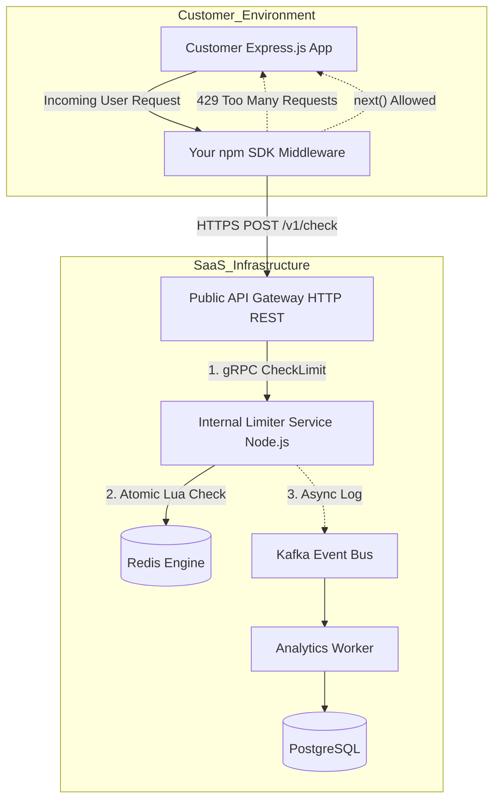

# Distributed API Rate Limiter as a Service (SaaS)

A production-grade, highly available Rate Limiting backend and SDK designed to protect public APIs. Built with **Node.js, gRPC, Redis, Kafka, and PostgreSQL**, this system processes rate-limit checks in sub-10 milliseconds while maintaining strict atomicity and eventual consistency for analytics.

## System Architecture

The system is decoupled into an ultra-fast critical path for request authorization and a background asynchronous path for zero-loss analytics.

# Engineering Trade-offs & System Design
This project was built to solve the most common failures in distributed rate limiting:

Preventing Race Conditions: Instead of reading and writing to Redis from Node.js (which fails under concurrent load), the core Sliding Window algorithm is written in a Lua Script and executed natively inside Redis. This guarantees absolute atomicity per request.

Minimizing Latency (gRPC): The internal Limiter Service communicates with the API Gateway via gRPC (HTTP/2 + Protobufs), drastically reducing serialization overhead compared to standard JSON REST APIs.

Database Bottlenecks & Caching: Querying PostgreSQL for user tier rules on every request would crush the database. Instead, the Node.js service utilizes an In-Memory Cache that periodically synchronizes with PostgreSQL, allowing sub-millisecond rule lookups.

Zero-Loss Async Analytics: Logging usage data synchronously degrades API response times. This system uses the "Fire and Forget" pattern. The Limiter Service drops a lightweight payload into an Apache Kafka topic and immediately responds to the user. A separate worker service consumes these events and bulk-inserts them into PostgreSQL.

Technology Stack
## Core Backend: Node.js, Express.js
## Internal RPC: gRPC, Protocol Buffers
## Engine / State: Redis, Lua Scripting
## Event Broker: Apache Kafka (KRaft mode)
## Persistent Storage: PostgreSQL
