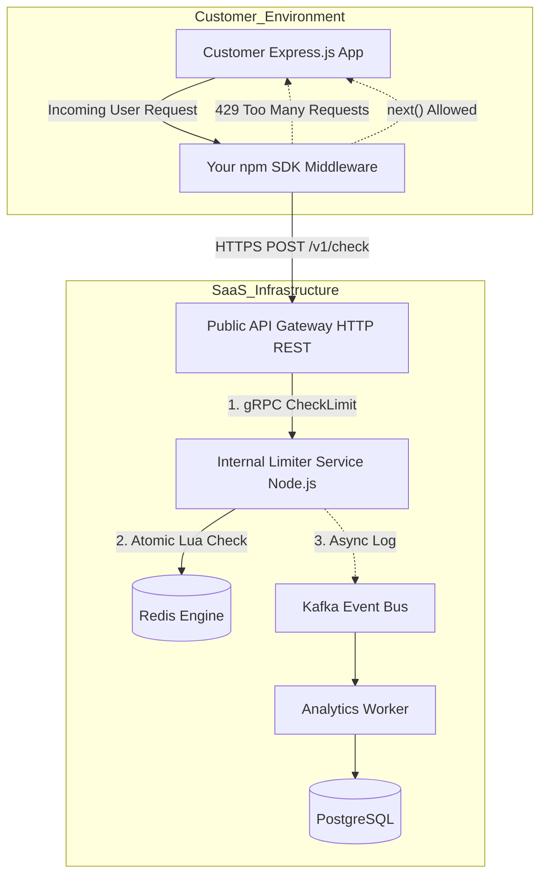

# 🚀 Distributed API Rate Limiter as a Service (SaaS)

A production-grade, highly available Rate Limiting backend and SDK designed to protect public APIs. Built with **Node.js, gRPC, Redis, Kafka, and PostgreSQL**, this system processes rate-limit checks in sub-10 milliseconds while maintaining strict atomicity and eventual consistency for analytics.


---

## ✨ Key Features

* **Sub-10ms Latency:** Utilizes gRPC and Protocol Buffers for blazing-fast internal microservice communication.
* **Race-Condition Proof:** Executes a Sliding Window algorithm via atomic Lua scripts directly inside the Redis engine.
* **Zero-Data-Loss Analytics:** Implements a "Fire and Forget" event-driven pipeline using Apache Kafka to log traffic data asynchronously without blocking the critical path.
* **Plug-and-Play SDK:** Provides a lightweight Express.js middleware for instant integration into consumer applications.

---

## 🧠 System Architecture

The system is decoupled into an ultra-fast critical path for request authorization and a background asynchronous path for reliable analytics processing.


# Engineering Trade-offs & System Design
This project was built to solve the most common architectural failures in distributed rate limiting:

Preventing Race Conditions: Instead of reading and writing to Redis from Node.js (which fails under concurrent load across distributed nodes), the core Sliding Window algorithm is written in a Lua Script and executed natively inside Redis. This guarantees absolute atomicity per request.

Minimizing Latency (gRPC): The internal Limiter Service communicates with the API Gateway via gRPC (HTTP/2 + Protobufs), drastically reducing serialization overhead and payload size compared to standard JSON REST APIs.

Database Bottlenecks & Caching: Querying PostgreSQL for user tier rules on every incoming request would crush the database. Instead, the Node.js service utilizes an In-Memory Cache that periodically synchronizes with PostgreSQL, allowing sub-millisecond rule lookups.

Zero-Loss Async Analytics: Logging usage data synchronously degrades API response times. This system uses the "Fire and Forget" pattern. The Limiter Service drops a lightweight payload into an Apache Kafka topic and immediately responds to the user. A separate worker service consumes these events and bulk-inserts them into PostgreSQL in the background.

# Technology Stack
* **Core Backend**: Node.js, Express.js
* **Internal RPC**: gRPC, Protocol Buffers
* **Engine / State**: Redis, Lua Scripting
* **Event Broker**: Apache Kafka (KRaft mode)
* **Persistent Storage**: PostgreSQL
* **Infrastructure**: Docker, Docker Compose

# Getting Started (Local Development)
**Prerequisites:**
* Docker & Docker Compose
* Node.js (v18+)
* NPM

## 1. Spin up the Infrastructure
Start the Redis, Kafka, and PostgreSQL containers in the background:

Bash
```
docker-compose up -d
```

## 2. Start the Microservices
### You will need three separate terminal windows to run the distributed system locally.
### Terminal 1: Analytics Worker (Consumes Kafka events)

Bash
```
cd analytics-worker
npm install
node src/index.js
```

### Terminal 2: Limiter Service (The gRPC Brain)

Bash
```
cd limiter-service
npm install
node src/index.js
```
### Terminal 3: Public API Gateway (Exposes the service to the SDK)

Bash
```
cd api-gateway
npm install
node src/index.js
```

# Using the SDK
Developers can protect their Express.js APIs instantly using the official NPM package.

### Installation
Bash
```
npm install ryze_rate_limiter express
```
### Quickstart Example
JavaScript
```
const express = require('express');
const RateLimiter = require('ryze_rate_limiter');

const app = express();

// 1. Initialize the SaaS SDK
const limiter = new RateLimiter({ 
    apiKey: 'your_saas_api_key',
    baseUrl: 'http://localhost:3000' // Point to the API Gateway
});

// 2. Protect routes with a single line of middleware
app.use('/api/secure-data', limiter.express());

app.get('/api/secure-data', (req, res) => {
    res.json({ message: "Success! The rate limiter allowed this through." });
});

app.listen(8080, () => console.log("Customer app running on port 8080"));
```
